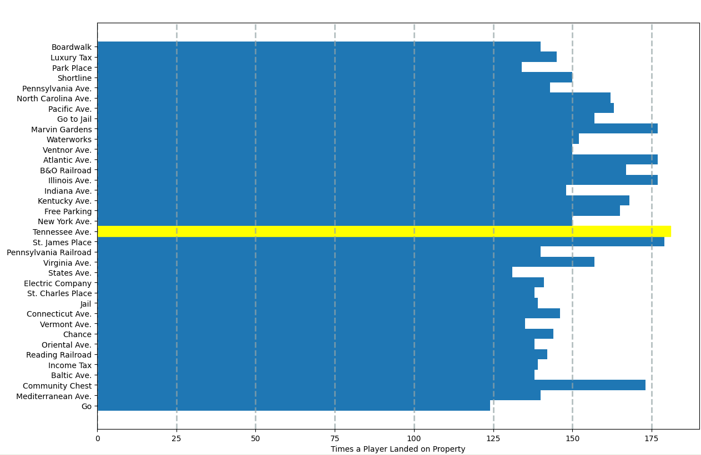

# Monopoly Simulation
This python3 program simulates a very simple monopoly game and creates a bar graph highlighting the property that was landed on the most.

To run: 
python3 MonopolySimulation.py

